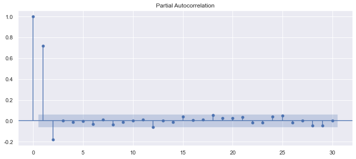
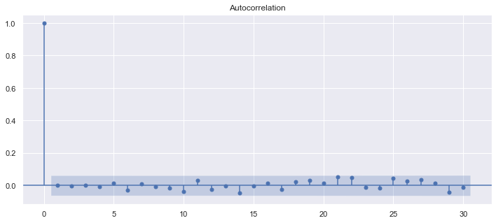
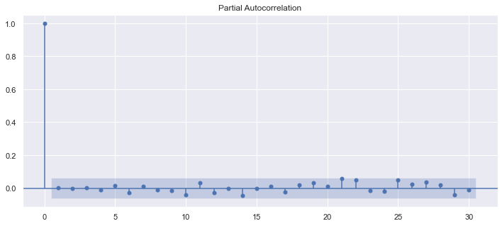

## 时间序列作业4(Python版)


```python
import numpy as np
import pandas as pd
from datetime import datetime
import matplotlib.pylab as plt
import seaborn as sns
%matplotlib inline 
%pylab inline
plt.rcParams['font.sans-serif'] = ['SimHei'] #用来正常显示中文标签
plt.rcParams['axes.unicode_minus']=False #用来正常显示负号
mpl.rcParams['axes.unicode_minus'] = False           # 解决保存图像是负号'-'显示为方块的问题
plt.rcParams['axes.unicode_minus'] = False #用来正常显示负号
pylab.rcParams['figure.figsize'] = (12, 5)   #设置输出图片大小
sns.set(color_codes=True) #seaborn设置背景
```

    Populating the interactive namespace from numpy and matplotlib


    C:\Users\xuyil\anaconda3\lib\site-packages\IPython\core\magics\pylab.py:159: UserWarning: pylab import has clobbered these variables: ['datetime', 'plt']
    `%matplotlib` prevents importing * from pylab and numpy
      warn("pylab import has clobbered these variables: %s"  % clobbered +

```python
from statsmodels.graphics.tsaplots import plot_acf  #自相关图
from statsmodels.tsa.stattools import adfuller as ADF  #平稳性检测
from statsmodels.graphics.tsaplots import plot_pacf    #偏自相关图
from statsmodels.stats.diagnostic import acorr_ljungbox    #白噪声检验
from statsmodels.tsa.arima_model import ARIMA #ARIMA模型
from statsmodels.tsa.seasonal import seasonal_decompose #decompose函数
import statsmodels.tsa.api as smt #引入AR模型
import statsmodels.api as sm #核心api
```

### a) 
```
Simulate a time series of length 1000 for the following model, giving appropriate R code and placing the simulated data in a vector x:
```
$$
x_t=\frac{5}{6}x_{t-1}-\frac{1}{6}x_{t-2}+\omega_t
$$

```python
np.random.seed(1)
n_samples = int(1000)
x=np.random.randn(1000)
w=np.random.randn(1000) # Simulate a time series of length 1000
```


```python
a1=5/6
a2=-1/6 #设定a1,a2
```


```python
for t in range(n_samples):
    x[t] = a1*x[t-1] +a2*x[t-2]+w[t] #生成公式
```

### b) 
```
Plot the correlogram and partial correlogram for the simulated data.Comment on the plot
```


```python
ax1 = plot_acf(x) #画x序列的acf
```


​    

​    

```python
ax2=plot_pacf(x) #画x序列的pacf
```



​    

**Comment:看得出还是挺明显的二阶。**

### c)

```
Fit an AR model to the data in x giving the parameter estimates and order of the fitted AR process
```


```python
mdl = smt.AutoReg(x,lags=2).fit() #载入AR模型拟合x
```

    C:\Users\xuyil\anaconda3\lib\site-packages\statsmodels\tsa\ar_model.py:248: FutureWarning: The parameter names will change after 0.12 is released. Set old_names to False to use the new names now. Set old_names to True to use the old names. 
      warnings.warn(

```python
mdl.params
```


    array([ 0.03003644,  0.84489827, -0.17913947])


```python
print('拟合的a1为:\n',mdl.params[1])
print('拟合的a2为:\n',mdl.params[2])
```

    拟合的a1为:
     0.844898268926016
    拟合的a2为:
     -0.17913946969773747


### d) 
```
Construct 95% confidence intervals for the parameter estimates of the fitted model. Do the model parameters fall within the confidenceintervals? Explain your result
```


```python
mdl.summary() #查看模型拟合的总结
```


<table class="simpletable">
<caption>AutoReg Model Results</caption>
<tr>
  <th>Dep. Variable:</th>         <td>y</td>        <th>  No. Observations:  </th>   <td>1000</td>   
</tr>
<tr>
  <th>Model:</th>            <td>AutoReg(2)</td>    <th>  Log Likelihood     </th> <td>-1443.675</td>
</tr>
<tr>
  <th>Method:</th>         <td>Conditional MLE</td> <th>  S.D. of innovations</th>   <td>1.028</td>  
</tr>
<tr>
  <th>Date:</th>          <td>Sun, 17 Oct 2021</td> <th>  AIC                </th>   <td>0.063</td>  
</tr>
<tr>
  <th>Time:</th>              <td>21:58:25</td>     <th>  BIC                </th>   <td>0.083</td>  
</tr>
<tr>
  <th>Sample:</th>                <td>2</td>        <th>  HQIC               </th>   <td>0.071</td>  
</tr>
<tr>
  <th></th>                     <td>1000</td>       <th>                     </th>     <td> </td>    
</tr>
</table>
<table class="simpletable">
<tr>
      <td></td>         <th>coef</th>     <th>std err</th>      <th>z</th>      <th>P>|z|</th>  <th>[0.025</th>    <th>0.975]</th>  
</tr>
<tr>
  <th>intercept</th> <td>    0.0300</td> <td>    0.033</td> <td>    0.922</td> <td> 0.357</td> <td>   -0.034</td> <td>    0.094</td>
</tr>
<tr>
  <th>y.L1</th>      <td>    0.8449</td> <td>    0.031</td> <td>   27.180</td> <td> 0.000</td> <td>    0.784</td> <td>    0.906</td>
</tr>
<tr>
  <th>y.L2</th>      <td>   -0.1791</td> <td>    0.031</td> <td>   -5.763</td> <td> 0.000</td> <td>   -0.240</td> <td>   -0.118</td>
</tr>
</table>
<table class="simpletable">
<caption>Roots</caption>
<tr>
    <td></td>   <th>            Real</th>  <th>         Imaginary</th> <th>         Modulus</th>  <th>        Frequency</th>
</tr>
<tr>
  <th>AR.1</th> <td>           2.3582</td> <td>          -0.1452j</td> <td>           2.3627</td> <td>          -0.0098</td>
</tr>
<tr>
  <th>AR.2</th> <td>           2.3582</td> <td>          +0.1452j</td> <td>           2.3627</td> <td>           0.0098</td>
</tr>
</table>


```python
(5/6>0.784) & (5/6<0.906) #判断a1是否在置信区间
```


    True


```python
(-1/6>-0.240) & (-1/6<-0.118) #判断a2是否在置信区间
```


    True

**Conclusion:The model parameters fall within the confidence intervals**.

### e)

```
Is the model in Equation (4.25) stationary or non-stationary? Justify your answer
```


```python
ADF(x) #采用adfuller工具进行平稳性检验
```


    (-14.270992313617125,
     1.3744148530156528e-26,
     1,
     998,
     {'1%': -3.4369193380671, '5%': -2.864440383452517, '10%': -2.56831430323573},
     2831.312315836158)

第一个值：表示Test Statistic，即T值，表示T统计量
第二个值：p-value，即p值，表示T统计量对应的概率值
第三个值：Lags Used，即表示延迟
第四个值：Number of Observations Used，即表示测试的次数
大括号中的值，分别表示1%、5%、10% 的三个level。
可以看到p-value的值小于5%，所以可以认为该数据是平稳的。
这里的5%是常用的阈值，也可以根据自己的实际需求进行设定。


```python
ADF(x)[1]>0.05
```


    False

**Conclusion:Model in Equation (4.25) is stationary.**


### f)

```
Plot the correlogram of the residuals of the fitted model, and commenton the plot
```


```python
ax2=plot_acf(mdl.resid) #绘制残差的acf图
```



    

```python
ax2=plot_pacf(mdl.resid) #绘制残差的pacf图
```



    

**Comment：看上去残差已经是很平稳的白噪音了。**
