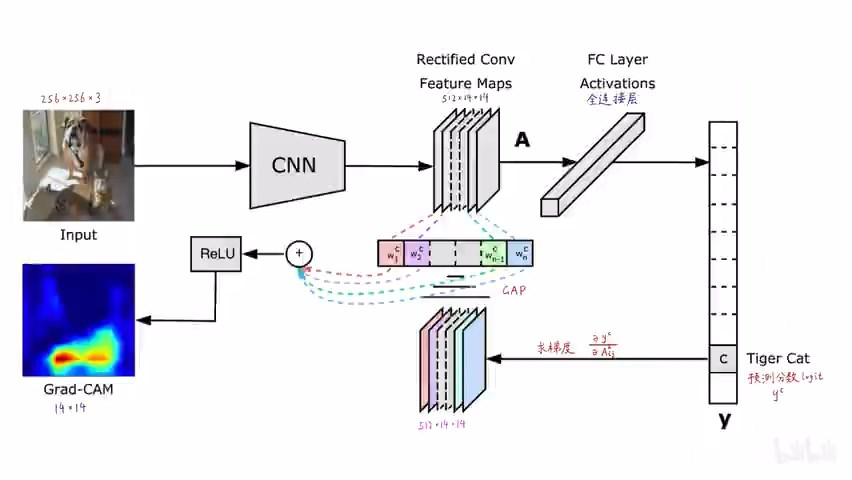
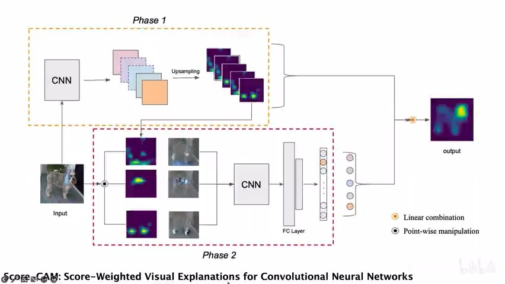

# Task04 【算法】Grad-CAM

## 1 CAM类激活热力图（回顾）

- CAM算法的精妙之处：
    1. 对深度学习实现可解释性分析、显著性分析
    2. 可扩展性强，后续衍生出各种基于CAM的算法
    3. 每张图片、每个类别，都能生成CAM热力图
    4. 弱监督定位：图像分类模型解决定位问题
    5. 潜在的“注意力机制”
    6. 按权重排序可得特征重要度，辅助Machine Teaching

- CAM算法中必须有GAP层，否则无法计算每个channel的权重，如果没有GAP层，需要把全连接层替换为GAP，再重新训练模型

- CAM算法的缺点：
    1. 必须要有GAP层，否则需要修改模型结构后重新训练
    2. 只能分析最后一层卷积层输出，无法分析中间层
    3. 仅限图像分类任务

## 2 Grad-CAM简介

- 理论来源：Grad-CAM:Visual Explanations from Deep Networks via Gradient-based Localization（ICCV 2017）论文,《Grad-CAM：基于梯度的弱监督定位视觉可解释性分析方法》

- 论文中提到的模型特点：
    1. 可以预测失败的样例，解释预测错误的样本
    2. 比 ILSVRC-15 弱监督定位任务的模型要好
    3. 比 CAM 模型更可信任
    4. 能更好地判断模型是否学习到了无关特征

- Grad-CAM算法的优点：
    1. 无需GAP层，无需修改模型结构，无需重新训练模型
    2. 可分析任意中间层
    3. 数学上是原生CAM的推广
    4. 可用于细粒度图像分类、Machine Teaching

- Grad-CAM算法的缺点：
    1. 图像上有多个同类物体时，只能画出一块热力图
    2. 不同位置的梯度值，GAP平均之后产生的影响是相同的
    3. 梯度饱和、梯度消失、梯度噪声
    4. 权重大的channel，不一定对类别预测分数贡献大
    5. 只考虑从后往前的反向传播速度，没有考虑前向预测的影响
    6. 深层生成的粗粒度热力图和浅层生成的细粒度热力图都不够精准

## 3 相关工作

- CNN可视化：不同类别的可视化在类别判别性上都很弱，效果几乎都一样
- 模型评价可信性：通过人工的方法评价模型的可信程度
- 弱监督定位：CAM要求模型必须有GAP层，只能分析最后一层，仅限于图像分类
- 图像遮挡测试：需要通过多次遮挡，并多次训练模型

## 4 Grad-CAM算法原理

- 网络结构：将该类别的预测分数$y^c$对最后一层卷积层的feature map进行求梯度，可得$\displaystyle \frac{\partial y^c}{\partial A^k_{ij}}$，将得到的结果进行GAP，得到对应的权重$w_1^c, w_2^c, \cdots, w_n^c$，再和最后一层卷积层的feature map进行对应相乘求和，最后再通过ReLU，得到Grad-CAM图

&emsp;&emsp;假设Grad-CAM热力图为$L^c_{\text{Grad-CAM}} \in \mathbb{R}^{u \times v}$，其中$c$为类别。

&emsp;&emsp;首先，可计算得到类别$c$的线性分类logit分数为$y^c$，对最后一个卷积层输出的feature map的$A^k$求导，可得$\displaystyle \frac{\partial y^c}{\partial A^k}$。

&emsp;&emsp;计算GAP，可得到第$k$个channel对类别$c$的权重：
$$
\alpha_k^c = \frac{1}{Z} \sum_i^n \sum_j^n \frac{\partial y^c}{\partial A^k_{ij}}
$$

&emsp;&emsp;再与$A^k$对应相乘，经过ReLU，可得Grad-CAM热力图表达式：
$$
L^c_{\text{Grad-CAM}} = ReLU \left( \sum_k \alpha^c_k A^k \right)
$$

&emsp;&emsp;再将后向传播的结果和Grad-CAM进行逐个元素相乘，得到高精度的Guided Grad-CAM图。

- 弱监督定位实验：使用ILSVRC-15数据集，利用VGG16模型，与Backprop、c-MWP、GAP进行对比，Grad-CAM效果是最好的。

## 5 可视化评价

- 评价类别判别性：基于VOC2007图像数据集，并通过ATM众包平台上的志愿者进行问答选择，评价不同显著分析方法，比较不同的可视化方法。

- 评价模型分类依据：使用VGG和AlexNet模型，并通过将两个模型生成的图片进行对比，让志愿者进行问答选择。通过这种实验方法，与人的直觉一致的算法，其分类准确率越高。

- 显著性分析可视化方法的准确性与模型本身的可解释性：将Grad-CAM与遮挡实验对比，可得更高的自相关性。

## 6 图像描述和视觉问答

- 图像描述：通过Dense Captioning给出一张图像，算法需要在图像上画出多个框，并且给每个框进行文字描述。
- 视觉问答：先用CNN编码图像，用RNN编码问题，将图像和问题的编码融合在一起，最后输出结果，对每一个类别进行Grad-CAM可视化。

## 7 后续CAM变种算法

- Grad-CAM++算法：主要解决Grad-CAM算法缺点中的1、2的问题

- ScoreCAM：主要解决Grad-CAM算法缺点中的3、4、5的问题

- LayerCAM：主要解决Grad-CAM算法缺点中的6的问题

## 8 本章总结

本次任务，主要介绍了Grad-CAM算法和论文中的内容，包括：  

1. 回顾CAM算法
2. Grad-CAM主要是基于CAM的推广，无需GAP层，可分析任意中间层
3. 介绍Grad-CAM的基本原理，将后向传播的结果和Grad-CAM进行逐个元素相乘，得到高精度的Guided Grad-CAM图
4. 从评价类别判别性、模型分类依据等方面进行可视化评价
5. 在图像描述和视觉问答场景中，有较好的性能
6. 简要介绍了后续CAM变种算法，包括Grad-CAM++、ScoreCAM和LayerCAM等算法
