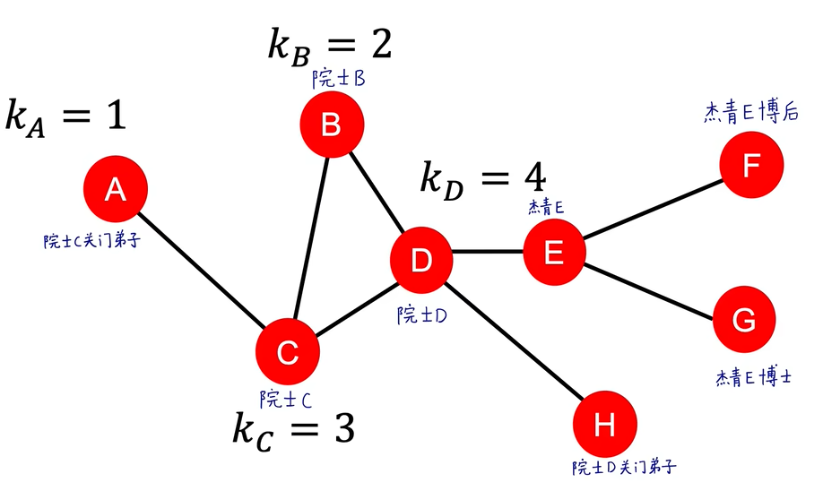
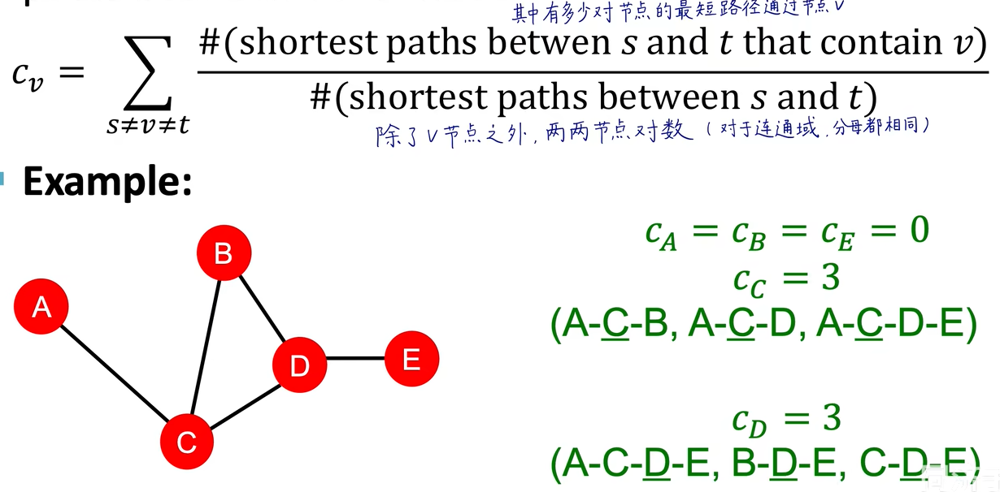
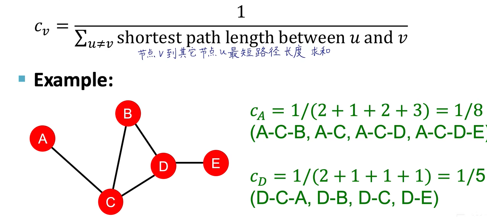
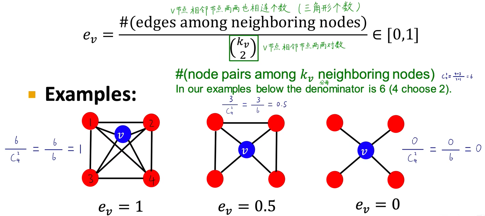
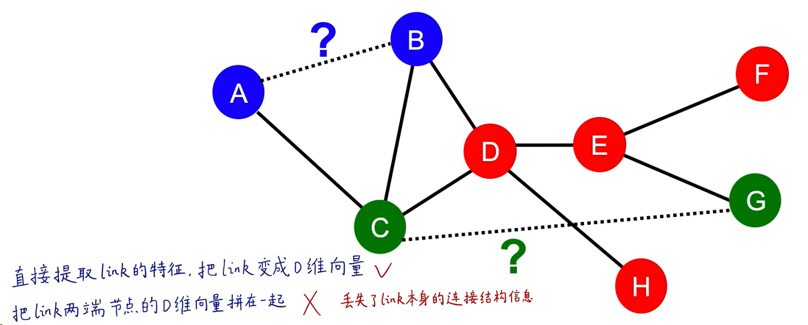
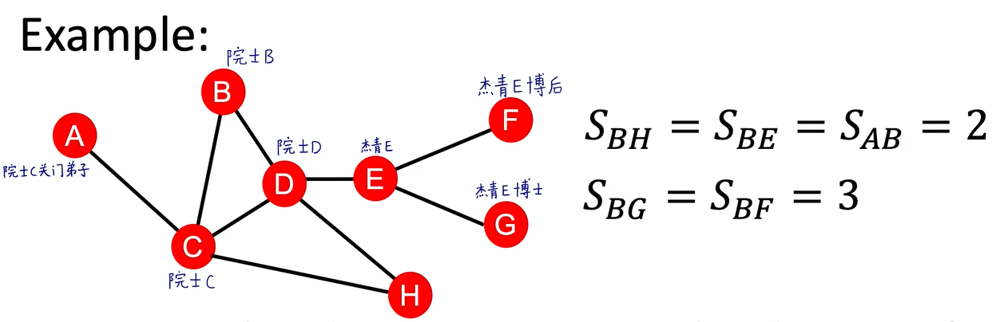
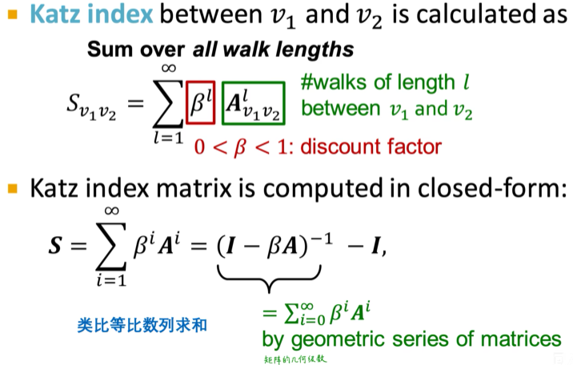

# Task02：图的基本表示和特征工程学习笔记

学习内容来自：[斯坦福大学CS224W图机器学习公开课-同济子豪兄中文精讲](https://github.com/TommyZihao/zihao_course/tree/main/CS224W#%E6%96%AF%E5%9D%A6%E7%A6%8F%E5%A4%A7%E5%AD%A6cs224w%E5%9B%BE%E6%9C%BA%E5%99%A8%E5%AD%A6%E4%B9%A0%E5%85%AC%E5%BC%80%E8%AF%BE-%E5%90%8C%E6%B5%8E%E5%AD%90%E8%B1%AA%E5%85%84%E4%B8%AD%E6%96%87%E7%B2%BE%E8%AE%B2)

> 同济子豪兄-中文精讲视频：https://www.bilibili.com/video/BV1pR4y1S7GA
>
> 本讲介绍了图数据挖掘的常见任务、典型方法、应用场景、编程工具。图是描述大自然各种关联现象的通用语言，图无处不在。不同于传统数据分析中样本独立同分布假设，图数据自带了关联结构，需要使用专门的图神经网络进行深度学习。 本讲介绍了斯坦福CS224W公开课的课程大纲；在节点、连接、子图、全图各个层面进行图数据挖掘的典型任务，以及在蛋白质结构预测、生物医药、内容推荐、文献挖掘、社交网络、开源项目评价等领域的应用。
>

## 1.本体笔记

本讲主要是通过人工设计的特征来进行图机器学习。

图机器学习的几个基本任务：

**节点层面**：输入某个d维节点的向量，输出该节点是某类的概率。是一个半监督问题。

**连接层面**：

子图/全图层面

我们需要把特征写成向量，输入到机器学习模型中。

**属性特征**

节点自身有属性特征。比如银行风控用户，每个用户是一个节点，它的属性特征有：收入、学历、年龄、婚姻、工作单位、征信等。

属性特征有时是多模态的。

**连接特征**

节点与其他节点的连接关系。大概分为四类：

连接数（node degree），只看数量，不看质量。例如地铁图，连接数高的站点通常是重要的枢纽。

这里举了一个院士之间重要程度的例子，如果只看节点连接数的话，A节点和G节点都是1，特征相同，但常识上显然二者的社交圈的影响力并不在一个数量级。

所以这时候就需要为不同的分配重要程度（node centrality），把节点的质量也展示出来。有几种不同的衡量重要的方法：
 1. 特征向量重要度。与邻接节点的重要度求和，这是一个递归的过程，最后转换成求矩阵的特质值和特征向量。特点是更加容易偏向更重要的节点。
 2. 中间状态（betweenness）重要度。看一个节点是否处在“交通咽喉，必经之地”。 

 3. 相近（closeness）重要度。表示一个节点去哪都近 

 4. 
聚类系数（clustering coefficient这里子豪兄通俗地说成了”抱团系数“，好评），衡量一个节点周围有多“抱团”。

子图模式（Graphlets自己构造的子图，类型小波变换 ）

思路：构造新的特征，使模型更容易区分出不同类型的数据（特征工程）。

Kaggle竞赛里，很多时候并不是调参，而是根据行业知识去人工构造可能有用的特征。

**设计过程**

把节点、全图变成d维的向量（d个特征），输入到机器学习算法里，去拟合和预测。

**子豪语录**
> 看待任何事物都要有数据挖掘的视野，就好比戴上了一副眼镜，把纷纷错乱的现象都可以用数据说话，这是一种思维方式。

**连接层面**
通过已知连接，补全未知连接。

有两种学习的任务：
1. 对客观静态图学习:随机删掉已有的连接，让模型去学习，是一种半监督的方法。
2. 随时间变化。使用上一个时间段的图去预测下一个时间段的连接，预测出n个连接，通过与真实的连接比较来学习。如论文的引用等。
都需要先提取连接的特征，输出成d维向量，然后输入给模型、评分。

连接的特征分为三类：
1. 基于两个节点的距离。最短路径长度。只看长度，忽略质量。

2. 基于两个节点局部的连接信息。通过共同连接个数，或者交并比。或者计算Adamic-Adar index，计算共同节点的影响力。
3. 基于两个节点在全图的连接信息。

## 2.思考题1

1. **连接层面，存在哪些数据挖掘任务，有何应用场景？**
    
    通过图中的已知连接，去学习和预测，来补全未知连接。
2. **连接层面可以构造哪些特征？这些特征可以归为哪三类？**
    
    连接的特征分为三类：1.基于两个节点的距离。2.基于两个节点局部的连接信息。3.基于两个节点在全图的连接信息。
3. **简述Link Prediction的基本流程**
   
   有两种学习的任务：
1.对客观静态图学习:随机删掉已有的连接，让模型去学习，是一种半监督的方法。
2.随时间变化。使用上一个时间段的图去预测下一个时间段的连接，预测出n个连接，通过与真实的连接比较来学习。如论文的引用等。
都需要先提取连接的特征，输出成d维向量，然后输入给模型、评分。
4. **A和B都知道梅西，C和D都知道同济子豪兄，请问哪对人物更容易产生社交连接。可以用哪个特征解释？**
    
    A和B的连接是梅西，这是一个公众人物，使用连接的特征来解释，这2个人的Aadmic-Adar比较弱，几乎没有联系；C和D都认识子豪兄，虽然也是公众人物，但更多出现在B站学习人工智能课程的人，这二人更容易产生联系。
5. **两个节点没有共同好友时，可以用什么特征，将连接编码为D维向量？**
6. **简述Katz Index的算法原理**

    使用powers of the graph adjacency matrix计算节点u和节点v之间长度为k的路径个数，是$A_{uv}^k$矩阵的第u行第v列的元素。

7. **如何计算节点U和节点V之间，长度为K的路径个数**
   
8. **为什么不直接把link两端节点的向量特征concat到一起，作为link的向量特征**

## 3.思考题2

1. **全图层面，存在哪些数据挖掘任务，有何应用场景？**
2. **全图层面可以构造哪些特征？**
3. **全图层面的Graphlet，和节点层面的Graphlet，有什么区别？**
4. **子图匹配，算法复杂度如何计算？**
5. **简述Weisfeiler-Lehman Kernel的算法原理**
6. **Weisfeiler-Lehman Kernel的词汇表（颜色表）是如何构建的？**
7. **Weisfeiler-Lehman Kernel，算法复杂度是多少？**
8. **Weisfeiler-Lehman Kernel和图神经网络（GNN）有什么关系？**
9. **简述Kernel Methods基本原理**
10. **为什么在Graph-level任务中，使用Kernel Methods**
11. **除了Graphlet Kernel和Weisfeiler-Lehman Kernel之外，还有哪些Kernel**
12. **传统图机器学习和特征工程中，哪些特征用到了邻接矩阵Adjacency Matrix？**
13. **如何把无向图节点、连接、全图的特征，推广到有向图？**
14. **如何用代码实现Weisfeiler-Lehman Kernel？**
