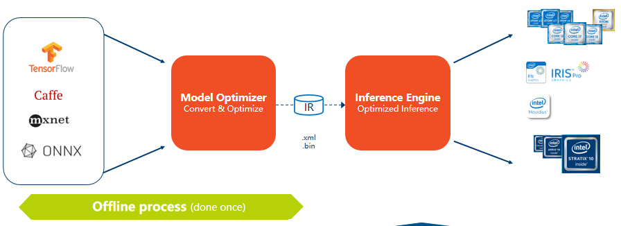

# Task02 学习如何使用OpenVINO

## 1 OpenVINO介绍

- 初级课程回顾
    1. 介绍了确定像素颜色的RGB表示，图像由许多像素构成，视频由许多图像构成，并讨论对图像进行模糊、锐化、边缘检测和特征提取等操作
    2. 使用Intel集成显卡加速视频编解码，利用Media-SDK调用Intel快速视频同步技术加速视频处理
    3. 介绍了人工智能算法、面向视觉应用的神经网络、实时执行神经网络的复杂性，并介绍了OpenVINO的推理引擎加速视频推理
    4. 介绍了OpenVINO套件支持视频分析、推理、计算及视觉视频处理的功能

- OpenVINO受欢迎的原因
    1. 简单性：支持批处理异步执行功能
    2. 性能：可将推理速度提高两倍。并将内存消耗降低五倍
    3. 可移植性：可以快速将原有代码移植到新设备上，实现产品的快速升级
    4. 全面性：支持完整设计流程

- OpenVINO简介：支持多个Intel架构基础平台，使用OpenCV处理计算机视觉，使用Media-SDK进行视频编解码与处理，使用DLDT进行推理

- 基于OpenVINO资源构建AI产品流程：模型准备（Model）、准备推理（Perpare Inference）、性能指标评测（Benchmark）、系统选择（Select System）、编解码能力（Decode Density）、完整流程（Full Pipeline）、AI应用（AI Application）

## 2 OpenVINO工具套件

### 2.1 应用构建流程

1. 找到合适的模型（Model）：使用一个基于深度学习的模型来执行分类、检测、分割等任务
2. 推理之前的准备（Prepare Inference）：模型通常是在云环境中训练，采用的是浮点格式，可支持模型格式转换
3. 性能指标评测（Benchmark）：使用多项优化技术和多种数据格式对多个模型进行基准测试
4. 选择系统（Select System）：选择能够满足性能要求的平台
5. 查看编解码密度：选择合适硬件需要考虑设备可以支持多少个摄像头，从设备硬件角度考虑编解码的能力
6. 模拟整个流程（Full Pipeline）：完整考虑解码、编码和推理等任务的整体运行，使用STREAMER模拟完整的工作负载
7. 构建AI应用（AI Application）：构建软件，或使用OpenVINO 将视频分析流程和推理整合到现有应用中

### 2.2 模型获取流程

1. 通过某个途径购买或下载模型或自行训练
2. 从OpenVINO Model-Zoo中下载模型：有40多种模型，可用于检测、分类、分割、重新识别、2D、3D、音频处理等，可以访问[Model-Zoo存储库](https://download.01.org/opencv)下载模型
3. 使用模型下载器：可以下载许多公开模型和所有Model-Zoo模型，指定所需的模型、具体精度（包括FP32、FP16、INT8）

### 2.3 模型优化器及推理流程

- 模型优化器（Model Optimizer）：跨平台的命令行工具，支持训练和部署环境之间的转换，执行静态模型分析并自动调整深度学习模型
- IR文件：模型优化器生成网络的中间表示，包括xml文件（网络拓扑）和bin文件（经过训练的数据文件，包含权重和偏差）
- 推理引擎（Inference Engine）：支持IR格式模型，使用相同的模型在多种设备上运行推理
- 处理流程：可采用离线方式，使用模型优化器将模型转成IR文件；有了IR文件，就可以反复进行推理

## 3 总结

&emsp;&emsp;本次任务，主要包括OpenVINO和工具套件的基本使用：
1. OpenVINO是Intel基于自身现有的硬件平台开发的一种可以加快高性能计算机视觉和深度学习视觉应用开发速度的工具套件
2. OpenVINO主要包括DLDT（模型优化器、推理引擎、推理引擎样本、工具）、开放预训练模型（DL Streamer、OpenCV、OpenCL、OpenVX）
3. 应用构建流程：模型准备、推理之前准备、性能指标评测、系统选择、编解码能力、模拟完整流程、构建AI应用
4. 获取深度学习模型：自行训练、从OpenVINO Model-Zoo下载模型、模型下载器
5. 人脸识别实验（性别和年龄检测）
6. 图像分类（使用SeqeezeNet1.1和ResNet-50模型）
