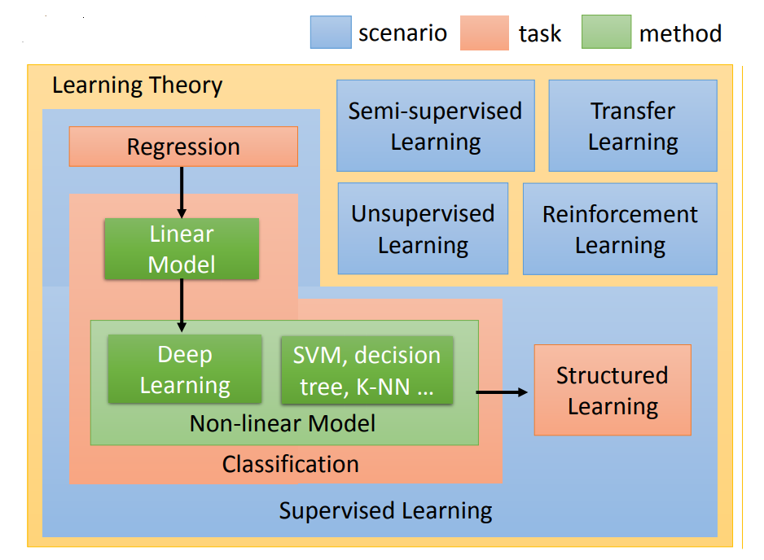

# Task01 机器学习介绍

## 1 生物本能与人工智慧

- 生物本能：河狸筑水坝，通过判断流水的声音大小，直到把声音完全覆盖
- 人工智慧：chat-bot构建`if`规则，达到相对的智慧，整个行为都是被规定好的，永远无法超越创造者

## 2 机器学习

- 应用场景举例：语音辨识、影像辨识等

- 概念：`Machine Learning`所做的事情，可以想象成寻找一个`function`，让机器具有一个能力，该能力是根据提供的资料，找到所要的`function`。

- 影像识别  
  1. 准备`function set`集合，内部有很多`function`用于猫狗识别
  2. 提供训练的资料（即分类准确的数据）
  3. 机器根据训练资料，判断一个`function`是否识别准确
  4. 通过有效的演算法，选取识别最准确的`function`
  5. 使用其他数据，测试这个`function`是否正确识别

## 3 机器学习相关技术

- 监督学习：
  1. Regression：输出一个数值；举例PM2.5的预测，找到一个`function`，输出未来某一个时间PM2.5的值。
  2. Classification：输出类别；举例垃圾邮件分类，训练一个`function`，输入一封邮件，判断该邮件是否为垃圾邮件
  3. 线性模型
  4. 非线性模型：深度学习、SVM等；举例AlphaGo下围棋，输入一个棋盘的格子，输出下一步应该落子的位置。
  5. 结构化学习：输出的结果要有结构性；举例语音识别，输入一段声音信号，输出一个句子

- 半监督学习：通过少量已标签和大量未标签的猫狗图片，训练模型

- 迁移模型：通过大量的已标签和未标签的其他动物图片，训练模型，识别猫狗

- 无监督模型：在完全没有任何标签的情况下，让机器学习；举例给机器看大量的文章，学会每一个词汇的意思

- 强化学习：没有告诉机器正确的答案是什么，所拥有的只有一个分数，即他做的好还是不好；通过与客人对话，根据最后打电话的结果，学习本次通话是否好坏。

## 4 学习机器学习的重要性

- 职位：AI训练师（其实还是算法岗）
- 职责：
  1. 挑选合适的`model`、`loss function`，不同的`model`、`loss function`适合解决不同的问题
  2. 不一定能找出`best function`

## 5 总结

&emsp;&emsp;本次任务，主要通过生物本能与人工智慧的讲解，介绍机器学习的应用场景，并通过猫狗影像识别的例子，讲解机器学习的基本步骤（准备训练数据、构建模型、训练模型、评估模型）；重点介绍机器学习中的技术分类，分为监督学习（包含结构化学习）、半监督学习、迁移学习、无监督学习、强化学习等；最后介绍了AI训练师相关的职责。
