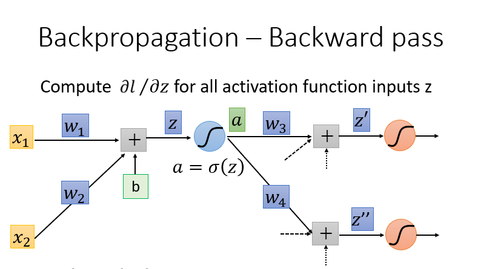

# Task04 深度学习介绍和反向传播机制

## 1 深度学习的三个步骤

### 1.1 构建神经网络

- 完全连接前馈神经网络  
概念：进入网络的信号只能单向传输，任意两层之间的连接没有反馈。  
网络结构：1个输入层，N个隐藏层，1个输出层，其中每层两两连接（全连接）。  

- 本质：通过隐藏层进行特征转换，将前面的隐藏层的输出当做输入，然后通过一个多分类器得到最后的输出

### 1.2 模型评估

- 评估方法：采用损失函数来反映模型的好坏，通过交叉熵进行模型评估

- 总体损失：计算所有训练数据的损失，获取一组神经网络的参数$\theta$，来最小化总体损失$L$

### 1.3 选择最优函数

- 选择方法：梯度下降
- 具体流程：
  1. $\theta$是一组包含权重和偏差的参数集合，随机找一个初试值，
  2. 计算每个参数对应偏微分，得到的一个偏微分的集合$\nabla L$就是梯度
  3. 不断地更新梯度，得到新的参数，
  4. 反复进行，得到一组最好的参数，使得损失函数的值最小

### 2 反向传播

### 2.1 链式法则

- $y=g(x),z=h(y)$，则$\displaystyle \frac{dz}{dx} = \frac{dz}{dy} \frac{dy}{dx}$
- $x=g(s),y=h(s),z=k(x,y)$，则$\displaystyle \frac{dz}{ds} = \frac{\partial z}{\partial x} \frac{dx}{ds} + \frac{\partial z}{\partial y} \frac{dy}{ds}$

### 2.2 反向传播

- 总体损失函数：
$$
L(\theta)= \sum_{n=1}^N C^n(\theta) \\
\frac{\partial L(\theta)}{\partial w} = \sum_{n=1}^N \frac{\partial C^n(\theta)}{\partial w}
$$
其中，$C^n(\theta)$表示代价函数，素有样本误差的总和平均

- 计算步骤：

1. 根据链式求导法，进行从后往前逐层计算
$$
\frac{\partial C}{\partial z} = \frac{\partial z'}{\partial a}\frac{\partial C}{\partial z'} +\frac{\partial z''}{\partial a}\frac{\partial C}{\partial z''} \\
\frac{\partial C}{\partial z} = \sigma'(z) \left[ w_3 \frac{\partial C}{\partial z'} + w_4 \frac{\partial C}{\partial z''} \right]
$$

2. 计算输出层，假设$y_1$与$y_2$是输出值
$$
\frac{\partial C}{\partial z'} = \frac{\partial y_1}{\partial z'} \frac{\partial C}{\partial y_1} \\
\frac{\partial C}{\partial z''} = \frac{\partial y_2}{\partial z''} \frac{\partial C}{\partial y_2}
$$

3. 计算其他层，可按照之前的公式逐步向前一层（隐藏层）计算

### 2.3 反向传播总结

1. 计算前向传播：$\displaystyle \frac{\partial z}{\partial w}$
2. 计算反向传播：$\displaystyle \frac{\partial C}{\partial z}$
3. 上述两项相乘之后，可得到$\displaystyle \frac{\partial C}{\partial w} = \frac{\partial C}{\partial z} \times \frac{\partial z}{\partial w}$
4. 得到神经网络的所有参数，然后用梯度下降进行更新，得到损失最小的`function` 

### 3 总结

&emsp;&emsp;本次任务，主要对深度学习进行简单介绍，并讲解了反向传播的理论和计算方法：

- 深度学习3个基本步骤：构建神经网络、模型评估、选择最优函数
- 链式法则：$\displaystyle \frac{dz}{ds} = \frac{\partial z}{\partial x} \frac{dx}{ds} + \frac{\partial z}{\partial y} \frac{dy}{ds}$
- 反向传播：主要用于更快的进行梯度下降，计算前向传播$\displaystyle \frac{\partial z}{\partial w}$，计算反向传播$\displaystyle \frac{\partial C}{\partial z}$，最后计算神经网络参数$\displaystyle \frac{\partial C}{\partial w} = \frac{\partial C}{\partial z} \times \frac{\partial z}{\partial w}$，使用梯度下降更快地得到最优函数。
