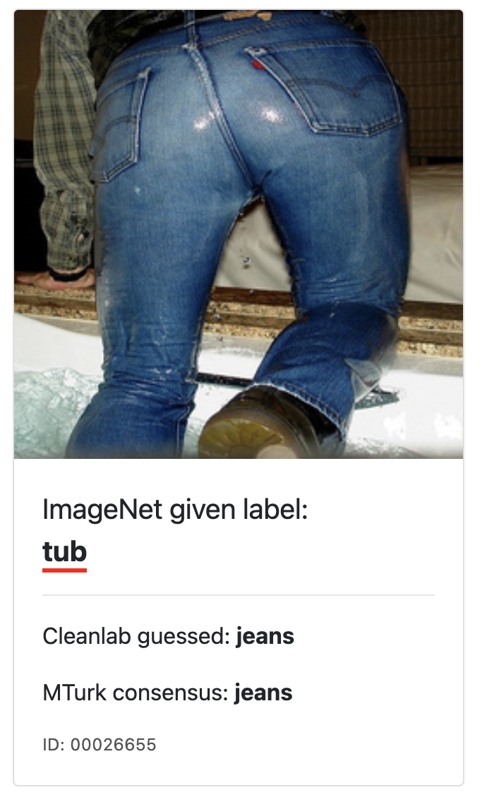
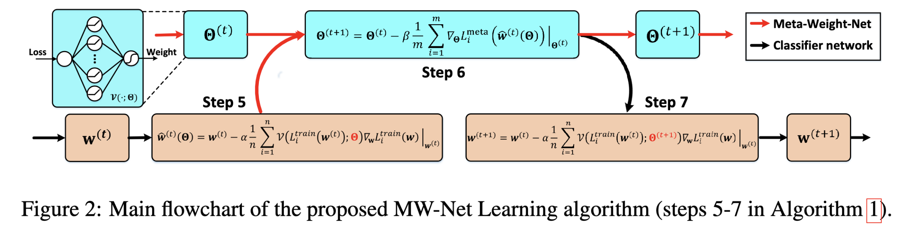

# Meta-Weight-Net论文阅读

最后更新：2023年2月8日 20:00

## 1.文章背景介绍

题目：Meta-Weight-Net: Learning an Explicit Mapping For Sample Weighting

论文主要解决的问题是深度神经网络在训练中会收到错误的标签及不平衡类别数据集的影响，而造成过拟合。

过去解决这类问题有一种方法：重新对样本进赋予权重，通过设计一个赋权函数（weighting function），这个函数是一个从training loss到样本权重（sample weight）的映射，并在迭代的过程中更新权重。最近的研究方法则是像设置超参数一样，手工预定义一个权重函数，这种方式受限于设计赋权函数的方式，因而难以适应于各种不同的场景。

这个设计存在着两种完全对立的想法：

一个是使函数单调递增，靠近决策边界的样本赋予较高的权重，这类方法有点像AdaBoost、focal loss和hard negative mining。这种方法更重视train loss，有助于提高类别较少的数据的准确率。

另外一种方法是使函数单独递减，认为train loss较小的样本更重要，因为它们可能是很干净的样本，有着较高的置信度。典型的方法如自步学习等。这种方法比较适用于噪声标签，因为它能有效抑train loss较大带来的影响。

此外还有很多适合鲁棒性学习的方法，但在实际实验中并没有得到充足的验证。目前的方法需要先假设训练数据符合某种分布，再手动设置赋权函数，当我们对数据集知之甚少时，这个效果就不会很好。因此，本文提出了一个直接从数据中学习赋权函数的方法，需要用到一个较小的无偏验证集，在这里称作元数据集，来训练这个网络的参数。使用一个隐藏层的MLP，**理论上可以逼近任何连续函数**。

### 1.1 文章用到的概念：

| 名词                          | 中文           | 解释                                                         | 图解                                                         |
| ----------------------------- | -------------- | ------------------------------------------------------------ | ------------------------------------------------------------ |
| class imbalance               | 类别不均衡     | 在自然情况下，数据往往都会呈现如下相同的长尾分布。这种趋势同样出现在从自然科学到社会科学的各个领域各个问题中，就像我们常说的二八定律。直接利用长尾数据来训练的分类和识别系统，往往会对头部数据过拟合，从而在预测时忽略尾部的类别。 |  |
| corrupted labels/noise labels | 噪音标签       | 在现实复杂的生活场景中，由于人工失误、原始数据噪声和专业知识不足等问题，导致实际采集得到的数据常常包含错误的标签，或者只包含少量的真实性可靠的标签。 |  |
| robust deep learning          | 鲁棒性深度学习 | 一个具有鲁棒性的模型就是即使当测试集的数据分布与训练集数据分布比较不同的时候，模型也能给出较好的预测结果。 |                                                              |
| real-world dataset            | 真实世界数据集 | 通常由网络上众包产生，错误标签较多。常见的有Clothing-1M，ANIMAL-10N，WebVision |                                                              |

## 2.算法设计

### 2.1 元学习的目标

训练集$\{x_i,y_i\}^N_{i=1}$其中$x_i$表示第i个样本，N是训练集的数量；标签$y_i\in\{0,1\}^c$，表示有c个类别。$f(x,w)$表示分类器，其中$w$是参数。

一般把$f(x,w)$设置成一个深度神经网络，通过最小化损失函数$L^{train}_i=\frac{1}{N}\Sigma_{i=1}^{N}l(y_i,f(x_i,w))$得到最优解$w^*$。

然后我们加入赋权模型$V(l;\Theta)$，$V(L_i^{train};\Theta)$表示对第i个样本加上的权重，$\Theta$表示赋权函数的参数，这样一来，求解最优的$w^*$就变成了这样的问题：
$$
w^*(\Theta)=\operatorname*{argmin}_w \mathcal{L}^{train}(w;\Theta)\triangleq\frac{1}{N}\sum_{i=1}^NV(L_i^{train}(w);\Theta)L_i^{train}(w)
$$
$\triangleq$符号表示“定义为”。

如何解这个优化问题呢，欢迎主角登场：**Meta-Weight-Net**。

MW-Net使用MLP来完成$V\left(L_i(w);\Theta\right)$的工作，只有一层隐藏层，并包含100个节点，每个节点使用ReLU激活，输出层使用Sigmoid函数激活，确保输出值在0～1之间。这个模型理论上可以拟合任意的连续函数。

### 2.2 算法描述：

假设我们有一组干净M个样本的的元学习数据集$\{x_i^{meta},y_i^{meta}\}_{i=1}^M$，M远小于N。

元数据集上的损失计算为：
$$
L_i^{meta}(w)=l\left(y_i^{(meta)},f(x_i^{(meta)},w)\right)
$$
初始化$w^{(0)}$和$\Theta^{(0)}$，然后从训练集里抽取一组包含n个样本的小批量数据，训练这批数据，使用SGD求解计算得到$w^{(1)}$：
$$
\hat{w}^{(0)}(\Theta)=w^{(0)}-\alpha\frac{1}{n}\times\sum^n_{i=0}V\left(L_i^{train}(w^{(0)}\right);\Theta)\nabla_wL_i^{train}(w)\Big|_{w^{(0)}}
$$

迭代计算得到$\hat{w}^{(0)}(\Theta)$后，代入到元学习模型里计算$\Theta$，这次从元数据集里抽取m组数据进行训练，通过求解得到：
$$
\Theta^{(1)}=\Theta^{(0)} - \beta\frac{1}{m}\sum_{i=1}^m\nabla_\Theta L_i^{meta}\left(\hat{w}^{(0)}(\Theta)\right)\Big|_{\Theta^{(0)}}
$$
得到$\Theta^{(1)}$后，再次回到我们的主分类模型里，抽取n组训练集，得到$\hat{w}^{(1)}$
$$
\hat{w}^{(1)}(\Theta)=w^{(0)}-\alpha\frac{1}{n}\times\sum^n_{i=0}V\left(L_i^{train}(w^{(0)});\Theta^{(1)}\right)\nabla_wL_i^{train}(w)\Big|_{w^{(0)}}
$$
后面就是重复上述步骤，直到训练结束。

 

### 2.3 核心代码：

取自https://github.com/ShiYunyi/Meta-Weight-Net_Code-Optimization

```python
for epoch in range(args.max_epoch): #开始训练
if epoch >= 80 and epoch % 20 == 0: #训练到第80轮后
    lr = lr / 10 #学习率除以10
for group in optimizer.param_groups:
    group['lr'] = lr

print('Training...')
for iteration, (inputs, labels) in enumerate(train_dataloader): # 读取训练集的数据，iteration从0开始索引，input是输出，labels是标签
    net.train() #训练外循环
    inputs, labels = inputs.to(args.device), labels.to(args.device) #丢进GPU

    if (iteration + 1) % args.meta_interval == 0: # meta_interval默认是1，结果一般都是True
        pseudo_net = ResNet32(args.dataset == 'cifar10' and 10 or 100).to(args.device) #这个应该是正式的模型，丢入GPU
        pseudo_net.load_state_dict(net.state_dict())  #加载已保存的模型
        pseudo_net.train() #模型训练

        pseudo_outputs = pseudo_net(inputs) #模型输出
        pseudo_loss_vector = functional.cross_entropy(pseudo_outputs, labels.long(), reduction='none') #计算预测的损失，以列表的方式输出
        pseudo_loss_vector_reshape = torch.reshape(pseudo_loss_vector, (-1, 1)) #拉平成n*1的张量
        pseudo_weight = meta_net(pseudo_loss_vector_reshape.data) #传入损失的数据并构建meta模型
        pseudo_loss = torch.mean(pseudo_weight * pseudo_loss_vector_reshape) #计算损失的均值

        pseudo_grads = torch.autograd.grad(pseudo_loss, pseudo_net.parameters(), create_graph=True)

        pseudo_optimizer = MetaSGD(pseudo_net, pseudo_net.parameters(), lr=lr) #使用SGD优化
        pseudo_optimizer.load_state_dict(optimizer.state_dict()) # 这是加载什么，优化器也要存档？
        pseudo_optimizer.meta_step(pseudo_grads)

        del pseudo_grads

        try:
            meta_inputs, meta_labels = next(meta_dataloader_iter) #读取元训练集
        except StopIteration:
            meta_dataloader_iter = iter(meta_dataloader)
            meta_inputs, meta_labels = next(meta_dataloader_iter)

        meta_inputs, meta_labels = meta_inputs.to(args.device), meta_labels.to(args.device) #丢入GPU
        meta_outputs = pseudo_net(meta_inputs) #丢入刚才训练好的模型得到输出
        meta_loss = criterion(meta_outputs, meta_labels.long()) #计算loss

        meta_optimizer.zero_grad()
        meta_loss.backward() #反向传播
        meta_optimizer.step() #迭代

    outputs = net(inputs)
    loss_vector = functional.cross_entropy(outputs, labels.long(), reduction='none')
    loss_vector_reshape = torch.reshape(loss_vector, (-1, 1))

    with torch.no_grad():
        weight = meta_net(loss_vector_reshape)

    loss = torch.mean(weight * loss_vector_reshape)

    optimizer.zero_grad()
    loss.backward()
    optimizer.step()
```

### 2.4 数学证明

还没看懂，略过。

## 3.相关工作

列举了一些给样本赋值权重的方法，包括了最早的数据集重采样（dataset resampling），或者叫实例重新赋权（instance re-weight），这些通常是借助一些先验知识来设计。而近年来，更多的人开始使用预先设计好的赋权函数（pre-designing a weighting function）去训练权重的映射。

而元学习的方法，主要是用于从数据中学习一个可以自适应权重的模型。典型的方法有FWL，Co-teach，MentorNet等，通过贝叶斯方法去逼近、注意力机制、双向LSTM。

最接近的方法叫做L2RW，和本文的方法很相似，主要的区别是，这个方法没有使用一个显性的权重函数来学习。这也是这个方法的缺点，因为学习过程中这种赋权方式并不稳定，而且很难推广到更多的任务。

 

## 4.实验设计

本文设计了三种不同的实验：类别不均衡实验、噪声标签实验和真实世界数据集实验。

### 4.1 类别不均衡实验

| 序号 | 类别     | 内容              | 说明                                                   |
| ---- | -------- | ----------------- | ------------------------------------------------------ |
| 1    | 数据集   | CIFAR10，CIFAR100 | 通过引入了一个“不平衡因子”把数据集改造成了一个长尾分布 |
| 2    | 优化器   | SGD               | 使用了动量法，初始学习率0.1                            |
| 3    | 模型     | ResNet-32         | 未经过预训练                                           |
| 4    | epoch    | 100               | 到第80轮和第90轮的时候把学习率除以10                   |
| 5    | 损失函数 | 交叉熵            | 多分类，使用的是Softmax                                |
|      | 元学习   | CIFAR10，CIFAR100 | 从每个类中选择10张图片。学习率固定为1e-5               |

模型比较的对手：

一号选手：基础模型，使用交叉熵损失的ResNet-32模型。

二号选手：Focal Loss，在重新赋权方法里的SOTA。

三号选手：Fine-tuning，把一号选手用元学习的方法强化一下。

四号选手：L2RW，提出这个方法的上一任老大哥。

### 4.2 错误标签实验

| 序号 | 类别     | 内容              | 说明                                                         |
| ---- | -------- | ----------------- | ------------------------------------------------------------ |
| 1    | 数据集   | CIFAR10，CIFAR100 | 通过引入了均匀噪声和翻转噪声                                 |
| 2    | 优化器   | SGD               | 使用了动量法0.9，初始学习率0.1，权重衰减5e-4                 |
| 3    | 实验次数 | 5                 | 每次使用了不同的随机种子，随机初始化，随机噪声数据生成，最后取5次平均的结果。 |
| 4    | epoch    | 40，60            |                                                              |
| 5    | 损失函数 | 交叉熵            | 多分类，使用的是Softmax                                      |
| 6    | 元学习   | CIFAR10，CIFAR100 | 从每个类中选择10张图片。学习率固定为1e-5                     |

均匀噪声（uniform noise）。随机生成独立同分布概率p的噪声标签。某一类会随机被标记成另外一类。比如猫会变成狗、狮子、熊等，毫无规律。

翻转噪声（flip nose）。意思是某一类标签会以同分布概率p变成某固定的一个分类的标签。比如猫会变成老虎，老虎也会变成猫，变成相似的类别。

数据集：还是两兄贵，CIFAR10、CIFAR100。都人为破坏了原有标签，同样以均匀的方式随机抽取了1000个验证集的样本作为元学习集。

使用模型：Wide ResNet-28-10（简称WRN-28-10）来对付均匀噪声，ResNet-32对付翻转噪声。

模型比较的对手：

一号选手：基础模型：用于鲁棒性学习的Reed、S-Model、SPL、Focal Loss、Co-teaching，D2L。

二号选手：微调后的上述模型。

三号选手：典型的元学习算法：MentorNet、L2RW、GLC。

四号选手：本来还训练了只用1000张图片的元数据集的模型，效果太差就不给大家看了。

### 4.3 真实世界数据集

| 序号 | 类别       | 内容       | 说明                                               |
| ---- | ---------- | ---------- | -------------------------------------------------- |
| 1    | 数据集     | Clothing1M | 1百万个样本，14个类别，其中有很多错误的标签。      |
| 2    | 优化器     | SGD        | 使用了动量法0.9，初始学习率0.1，权重衰减5e-4       |
| 3    | 模型       | ResNet-50  | 读取了预训练的模型。                               |
| 4    | epoch      | 10         | 5轮后学习率除以10                                  |
| 5    | 损失函数   |            |                                                    |
| 6    | 元学习     | Clothing1M | 7000个干净样本的数据集                             |
| 7    | 数据预处理 |            | 先把图像裁成256\*256，居中到224\*224，然后做标准化 |

实验结果见原文。

## 5.结论

实现了一种新颖的元学习算法来保证鲁棒性学习的效果。

