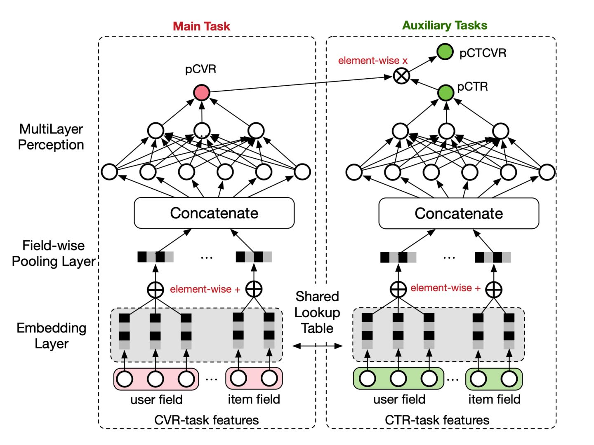

# Task04 多任务模型：ESMM、MMOE

## 1 ESMM

### 1.1 ESMM产生背景

- 样本选择偏差：构建的训练样本集的分布采样不准确
- 稀疏数据：点击样本占曝光样本的比例很小

### 1.2 ESMM原理

- 解决思路：基于多任务学习，引入CTR、CTCVR消除样本选择偏差和稀疏数据
- 三个预测任务：
1. pCTR：点击率预估模型
2. pCVR：转化率预估模型
3. pCTCVR： 点击和转化率预估模型

$$
\underbrace{p(y=1, z=1 | x)}_{pCTCVR}=\underbrace{p(y=1 | x)}_{pCTR} \times \underbrace{p(z=1 | y=1, x)}_{pCVR}
$$
其中$x$表示曝光，$y$表示点击，$z$表示转化



- 主任务和辅助任务共享特征，并利用CTCVR和CTR的`label`构造损失函数：
$$
\begin{aligned}
L(\theta_{c v r}, \theta_{c t r}) 
&= \sum_{i=1}^{N} l(y_{i}, f(\boldsymbol{x}_{i} ; \theta_{c t r})) \\
&+ \sum_{i=1}^{N} l(y_{i} \& z_{i}, f(\boldsymbol{x}_{i} ; \theta_{c t r}) \times f(\boldsymbol{x}_{i} ; \theta_{c v r}))
\end{aligned}
$$

- 解决样本选择偏差：在训练过程中，模型只需要预测pCTCVR和pCTR，即可更新参数，由于pCTCVR和pCTR的数据是基于完整样本空间提取的，故根据公式，可以解决pCVR的样本选择偏差
- 解决数据稀疏：使用共享的embedding层，使得CVR子任务也能够从只展示没点击的样本中学习，可以缓解训练数据稀疏的问题

### 1.3 ESSM模型的优化

- 论文中，子任务独立的Tower网络是纯MLP模型，可以根据自身特点设置不一样的模型，例如使用DeepFM、DIN等
- 引入动态加权的学习机制，优化loss
- 可构建更长的序列依赖模型，例如美团AITM信用卡业务，用户转换过程是曝光->点击->申请->核卡->激活

### 1.4 ESSM模型代码实现


```python
import torch
import torch.nn.functional as F
from torch_rechub.basic.layers import MLP, EmbeddingLayer
from tqdm import tqdm
```


```python
class ESMM(torch.nn.Module):
    def __init__(self, user_features, item_features, cvr_params, ctr_params):
        super().__init__()
        self.user_features = user_features
        self.item_features = item_features
        self.embedding = EmbeddingLayer(user_features + item_features)
        self.tower_dims = user_features[0].embed_dim + item_features[0].embed_dim
        # 构建CVR和CTR的双塔
        self.tower_cvr = MLP(self.tower_dims, **cvr_params)
        self.tower_ctr = MLP(self.tower_dims, **ctr_params)

    def forward(self, x):
        embed_user_features = self.embedding(x, self.user_features, 
                                             squeeze_dim=False).sum(dim=1) 
        embed_item_features = self.embedding(x, self.item_features, 
                                             squeeze_dim=False).sum(dim=1)
        input_tower = torch.cat((embed_user_features, embed_item_features), dim=1)
        cvr_logit = self.tower_cvr(input_tower)
        ctr_logit = self.tower_ctr(input_tower)
        cvr_pred = torch.sigmoid(cvr_logit)
        ctr_pred = torch.sigmoid(ctr_logit)
        
        # 计算pCTCVR = pCTR * pCVR
        ctcvr_pred = torch.mul(cvr_pred, cvr_pred)

        ys = [cvr_pred, ctr_pred, ctcvr_pred]
        return torch.cat(ys, dim=1)
```

## 2 MMOE

### 2.1 MMOE产生背景

- 多任务模型：在不同任务之间学习共性以及差异性，能够提高建模的质量以及效率。
- 多任务模型设计模式：
    1. Hard Parameter Sharing方法：底层是共享的隐藏层，学习各个任务的共同模式，上层用一些特定的全连接层学习特定任务模式
    2. Soft Parameter Sharing方法：底层不使用共享的shared bottom，而是有多个tower，给不同的tower分配不同的权重
    3. 任务序列依赖关系建模：这种适合于不同任务之间有一定的序列依赖关系

### 2.2 MOE模型和MMOE模型原理


#### 2.2.1 MOE模型（混合专家模型）

- 模型原理：基于多个`Expert`汇总输出，通过门控网络机制（注意力网络）得到每个`Expert`的权重
- 特性：模型集成、注意力机制、multi-head机制

#### 2.2.2 MMOE模型

- 基于OMOE模型，每个`Expert`任务都有一个门控网络
- 特性：
  1. 避免任务冲突，根据不同的门控进行调整，选择出对当前任务有帮助的`Expert`组合
  2. 建立任务之间的关系
  3. 参数共享灵活
  4. 训练时模型能够快速收敛

### 2.3 MMOE模型代码实现


```python
import torch
import torch.nn as nn

from torch_rechub.basic.layers import MLP, EmbeddingLayer, PredictionLayer
```


```python
class MMOE(torch.nn.Module):
    def __init__(self, features, task_types, n_expert, expert_params, tower_params_list):
        super().__init__()
        self.features = features
        self.task_types = task_types
        # 任务数量
        self.n_task = len(task_types)
        self.n_expert = n_expert
        self.embedding = EmbeddingLayer(features)
        self.input_dims = sum([fea.embed_dim for fea in features])
        # 每个Expert对应一个门控
        self.experts = nn.ModuleList(
            MLP(self.input_dims, output_layer=False, **expert_params) for i in range(self.n_expert))
        self.gates = nn.ModuleList(
            MLP(self.input_dims, output_layer=False, **{
                "dims": [self.n_expert],
                "activation": "softmax"
            }) for i in range(self.n_task))
        # 双塔
        self.towers = nn.ModuleList(MLP(expert_params["dims"][-1], **tower_params_list[i]) for i in range(self.n_task))
        self.predict_layers = nn.ModuleList(PredictionLayer(task_type) for task_type in task_types)

    def forward(self, x):
        embed_x = self.embedding(x, self.features, squeeze_dim=True)
        expert_outs = [expert(embed_x).unsqueeze(1) for expert in self.experts]  
        expert_outs = torch.cat(expert_outs, dim=1) 
        gate_outs = [gate(embed_x).unsqueeze(-1) for gate in self.gates]

        ys = []
        for gate_out, tower, predict_layer in zip(gate_outs, self.towers, self.predict_layers):
            expert_weight = torch.mul(gate_out, expert_outs)  
            expert_pooling = torch.sum(expert_weight, dim=1) 
            # 计算双塔
            tower_out = tower(expert_pooling)
            # logit -> proba
            y = predict_layer(tower_out)
            ys.append(y)
        return torch.cat(ys, dim=1)
```

## 3 总结

&emsp;&emsp;本次任务，主要介绍了ESSM和MMOE的多任务学习模型原理和代码实践：
1. ESSM模型：主要引入CTR和CTCVR的辅助任务，解决样本选择偏差和稀疏数据问题，基于双塔模型，并可根据自身特点设置两个塔的不同模型，子网络支持任意替换
2. MMOE模型：主要基于OMOE模型，其中每个`Expert`任务都有一个门控网络，下层是MOE基本模型，上层是双塔模型，满足各个任务在`Expert`组合选择上的解耦性，具备灵活的参数共享、训练快速收敛等特点
