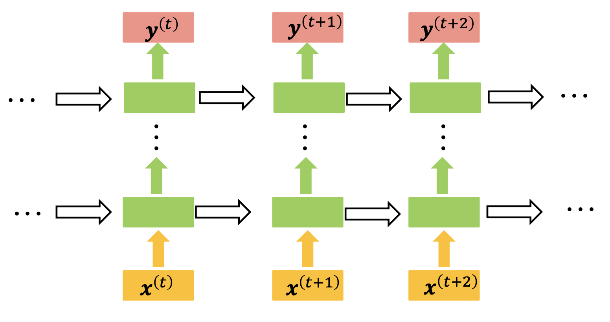
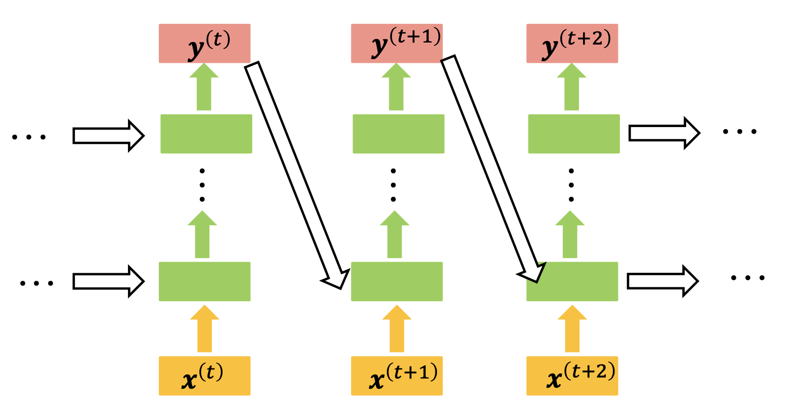
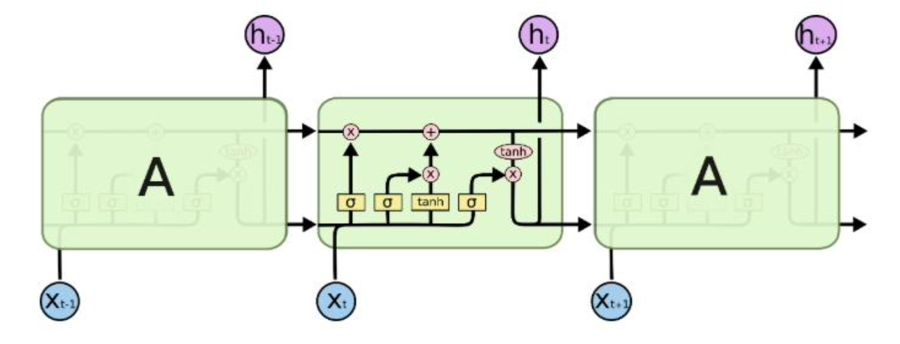

# Task05 循环神经网络RNN

## 1 计算图

- 计算图的基本概念：
  1. 描述计算机构的一种图
  2. 包括节点和边，节点表示变量、标量、矢量或张量等，边表示某个操作，用函数表示

- 计算图的求导：可使用链式求导法则
  1. 情况1
  ```mermaid
  graph LR
  A((x)) --"g"--> B((y)) --"h"--> C((z))
  ```
  $$
  \frac{dz}{dx} = \frac{dz}{dy} \frac{dy}{dx}
  $$
  2. 情况2
  ```mermaid
  graph LR
  A((s)) --"g"--> B((x)) --"k"--> C((z))
  A((s)) --"g"--> D((y)) --"k"--> C((z))
  ```
  $$
  \frac{dz}{ds} = \frac{\partial z}{\partial y} \frac{dy}{ds} + \frac{\partial z}{\partial x} \frac{dx}{ds}
  $$

## 2 循环神经网络（RNN）

### 2.1 循环神经网络的基本介绍

- 核心思想：样本间存在顺序关系，每个样本和它之前的样本存在关联。通过神经网络在时序上的展开，找到样本之间的序列相关性

- RNN的一般结构


其中，$x_t, s_t, o_t$分别表示的是$t$时刻的输入、记忆和输出，$U,V,W$是RNN的连接权重，$b_s,b_o$是RNN的偏置，$\sigma,\varphi$是激活函数，$\sigma$通常选tanh函数或sigmoid函数，$\varphi$通常选用softmax函数。

- softmax函数：将一个K维德任意实数向量映射为另一个K维实数向量，向量的每个元素取值都在0~1之间
$$
\sigma(\vec{z})_i = \frac{e^{z_i}}{\displaystyle \sum_{j=1}^K e^{z_j}}
$$

### 2.2 RNN的一般结构

- Elman Network


- Jordan Network


### 2.3 RNN训练算法BPTT

- BPTT算法构成：在BP算法的基础之上，添加了时序演化过程
- 算法步骤：
  1. 定义输出函数：
   $$
   \begin{array}{l}
   s_t = \tanh (U x_t + W s_{t-1}) \\
   \hat{y}_t = \text{softmax} (V s_t)
   \end{array}
   $$
  2. 定义损失函数：
   $$
   E_t (y_t, \hat{y}_t) = -y_t \log \hat{y}_t \\
   \begin{aligned} 
   E(y, \hat{y}) 
   &= \sum_t E_t (y_t, \hat{y}_t) \\ 
   &= -\sum_t y_t \log \hat{y}_t
   \end{aligned}
   $$
  3. 根据链式求导法，求损失函数$E$对U、V、W的梯度
   $$
   \begin{aligned} 
   \frac{\partial E_t}{\partial V} 
   &= \frac{\partial E_t}{\partial \hat{y}_t} \frac{\partial \hat{y}_t}{\partial V} \\
   &= \frac{\partial E_t}{\partial \hat{y}_t} \frac{\partial \hat{y}_t}{\partial z_t} \frac{\partial z_t}{\partial V} \\
   \frac{\partial E_t}{\partial W} 
   &= \frac{\partial E_t}{\partial \hat{y}_t} \frac{\partial \hat{y}_t}{\partial s_t} \frac{\partial s_t}{\partial W} \\
   &= \sum_{k=0}^t \frac{\partial E_t}{\partial \hat{y}_t} \frac{\partial \hat{y}_t}{\partial s_t} \frac{\partial s_t}{\partial s_k} \frac{\partial s_k}{\partial W} \\
   &= \sum_{k=0}^t \frac{\partial E_t}{\partial \hat{y}_t} \frac{\partial \hat{y}_t}{\partial s_t} \left( \prod_{j=k+1}^t \frac{\partial s_j}{\partial s_{j-1}} \right) \frac{\partial s_k}{\partial W} \\
   \frac{\partial E_t}{\partial U} 
   &= \frac{\partial E_t}{\partial \hat{y}_t} \frac{\partial \hat{y}_t}{\partial s_t} \frac{\partial s_t}{\partial U} \\ 
   &= \sum_{k=0}^t \frac{\partial E_t}{\partial \hat{y}_t} \frac{\partial \hat{y}_t}{\partial s_t} \frac{\partial s_t}{\partial s_k} \frac{\partial s_k}{\partial U}
   \end{aligned}
   $$

## 3 长短时记忆网络（LSTM）

- LSTM特点：
  1. 依靠贯穿隐藏层的细胞状态实现隐藏单元之间的信息传递，其中只有少量的线性操作
  2. 引入了“门”机制对细胞状态信息进行添加或删除，由此实现长程记忆
  3. “门”机制由一个Sigmoid激活函数层和一个向量点乘操作组成，Sigmoid层的输出控制了信息传递的比例

- 基本结构：一个LSTM单元由输入门、输出门和遗忘门组成


- 遗忘门：对细胞状态信息遗忘程度的控制，输出当前状态的遗忘权重
$$
f_t = \sigma\left( W_f \cdot \left[ h_{t-1}, x_t \right] + b_f \right)
$$


- 输入门：对细胞状态输入接收程度的控制，输出当前输入信息的接受权重
$$
i_t = \sigma \left(W_i \cdot \left[ h_{t-1}, x_t \right] + b_i \right) \\ 
\tilde{C}_t = \tanh \left( W_C \cdot \left[ h_{t-1}, x_t \right] + b_C \right) 
$$


- 输出门：对细胞状态输出认可程度的控制，输出当前输出信息的认可权重
$$
o_t = \sigma \left(W_o \cdot \left[ h_{t-1}, x_t \right] + b_o \right)
$$


- 状态更新：“门”机制对细胞状态信息进行添加或删除，由此实现长程记忆
$$
C_t = f_t * C_{t-1} + i_t * \tilde{C}_t \\ 
h_t = o_t * \tanh \left( C_t \right)
$$


## 4 其他经典的循环神经网络

- Gated Recurrent Unit（GRU）
  1. 它的细胞状态与隐状态合并，在计算当前时刻新信息的方法和LSTM有所不同
  2. GRU只包含重置门和更新门
  3. 在音乐建模与语音信号建模领域与LSTM具有相似的性能，但是参数更少，只有两个门控。

- Peephole LSTM：让门层也接受细胞状态的输入，同时考虑隐层信息的输入。

- Bi-directional RNN（双向RNN）：假设当前$t$的输出不仅仅和之前的序列有关，并且还与之后的序列有关

- Continuous time RNN（CTRNN）：
  1. 利用常微分方程系统对输入脉冲序列神经元的影响进行构建模型
  2. 应用于进化机器人中，用于解决视觉、协作和最小认知行为等问题

## 5 主要应用

- 语言模型：
  1. 单词预测：根据之前和当前词，预测下一个单词或字母
  2. 问答系统
- 自动作曲
- 机器翻译：将一种语言自动翻译成另一种语言
- 自动写作：基于RNN和LSTM的文本生成技术，需要训练大量同类文本，结合模板技术
- 图像描述：根据图像生成描述性语言

## 6 总结

&emsp;&emsp;本次任务，主要介绍了计算图、循环神经网络RNN及其训练算法、LSTM网络、其他经典循环神经网络、主要应用。循环神经网络的核心思想是样本间存在顺序关系，每个样本和它之前的样本存在关联。通过神经网络在时序上的展开，找到样本之间的序列相关性；其训练算法是通过对损失函数$E$求$U,V,W$的梯度，再更新参数。LSTM网络由LSTM单元构成，包括输入门、输出门和遗忘门，并通过“门”机制对细胞状态信息进行添加或删除，实现长程记忆。其他经典的循环神经网络主要介绍了Gated Recurrent Unit（GRU）、Peephole LSTM、Bi-directional RNN（双向RNN）和Continuous time RNN（CTRNN）。循环神经网络的主要应用场景是语言模型、自动作曲、机器翻译、自动写作、图像描述等。
